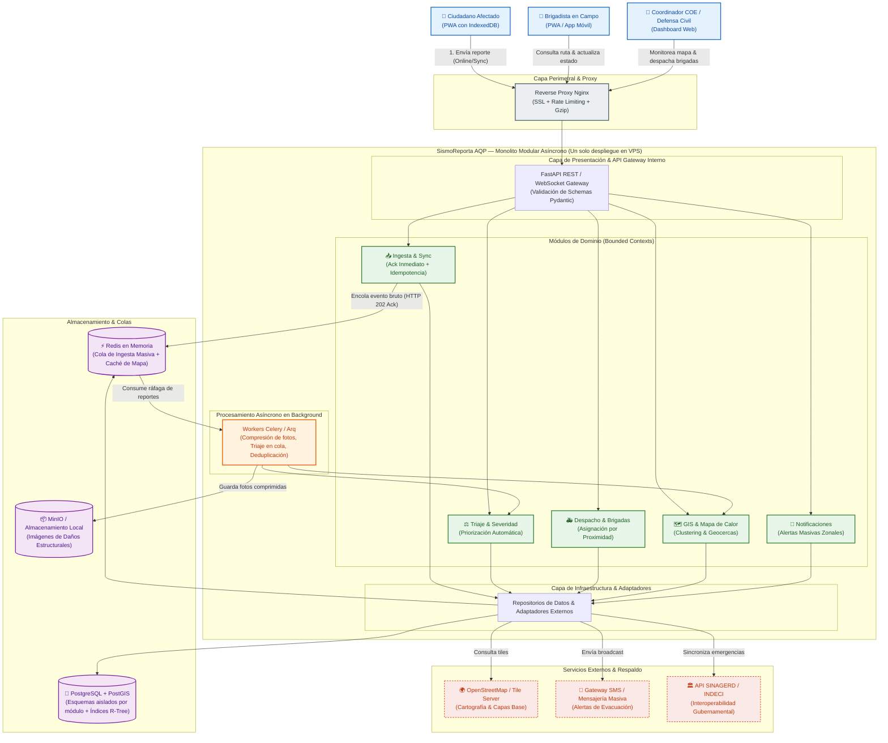

# SismoReporta AQP — Laboratorio 04: Fundamentos de Arquitectura de Software
**Construcción de Software · EPIS-UNSA · 2026-B · Grupo 08**  
Docente: Mg. Antonio Arroyo Paz

---

## Integrantes
| Nombre | Usuario GitHub | Correo Institucional | Rol en el Laboratorio |
| :--- | :---: | :---: | :--- |
| **Santiago Palma** | `@santiagopalma12` | `spalmaa@unsa.edu.pe` | Arquitecto de Software, Diagramador (Mermaid & Python Diagrams), Redactor de ADR-001 y ADR-003. |
| **Dario Rafael Cornejo Hurtado** | `@darich1010` | `dcornejohu@unsa.edu.pe` | Especialista en Resiliencia y Datos, Diagramador PlantUML, Redactor de ADR-002, Verificador y Auditor de IA. |

---

## Caso 8: SismoReporta AQP
Plataforma ciudadana y de coordinación de emergencias para la región Arequipa tras un evento sísmico de gran magnitud. Permite a los ciudadanos afectados registrar reportes de colapsos estructurales, personas atrapadas y vías bloqueadas adjuntando fotografías comprimidas y geolocalización GPS, incluso sin conectividad a internet. El sistema consolida los incidentes en un tablero de comando con mapa de calor para que el Centro de Operaciones de Emergencia (COE) y Defensa Civil prioricen zonas de auxilio y despachen brigadas de rescate en función de la severidad del daño.  
**Atributo de Calidad Crítico:** *Disponibilidad y Rendimiento ante picos extremos:* Absorber hasta **20,000 reportes en la primera hora** con la red móvil colapsada o intermitente, garantizando **0 reportes perdidos** mediante persistencia local en el cliente (IndexedDB) y sincronización asíncrona diferida con latencia de aceptación $p95 \le 1.5\text{ s}$.

---

## Arquitectura Elegida: Monolito Modular Asíncrono
La arquitectura seleccionada organiza el sistema en un único artefacto desplegable en Python estructurado en módulos de dominio desacoplados (*Ingesta*, *Triaje*, *Brigadas*, *GIS*, *Notificaciones*), empleando **Redis** como buffer de ingesta masiva en memoria y workers en segundo plano (**Celery/arq**) para compresión multimedia y procesamiento geoespacial sobre **PostgreSQL + PostGIS**.

---

## Decisiones Arquitectónicas (ADRs)
- [ADR-001: Adopción de Monolito Modular Asíncrono con Colas en Memoria](docs/architecture/adr/001-estilo-arquitectonico.md)
- [ADR-002: Estrategia de Cliente Offline-First mediante PWA con Service Workers e IndexedDB](docs/architecture/adr/002-estrategia-offline-pwa.md)
- [ADR-003: Selección de PostgreSQL con Extensión Espacial PostGIS para Persistencia y Análisis Geoespacial](docs/architecture/adr/003-base-de-datos-postgis.md)

---

## Modelado y Diagramas del Sistema
* **Drivers y Escenarios de Calidad:** [docs/architecture/drivers.md](docs/architecture/drivers.md)
* **Matriz de Decisión Ponderada:** [docs/architecture/matriz-decision.md](docs/architecture/matriz-decision.md)
* **Diagrama de Arquitectura Elegida (Mermaid):** [docs/architecture/diagramas/arquitectura.mmd](docs/architecture/diagramas/arquitectura.mmd)
* **Alternativa B Descartada (PlantUML):** [docs/architecture/diagramas/alternativa.puml](docs/architecture/diagramas/alternativa.puml)
* **Vista de Despliegue de Infraestructura (Python Diagrams):** [docs/architecture/diagramas/despliegue.py](docs/architecture/diagramas/despliegue.py)
* **Vista de Despliegue en PlantUML:** [docs/architecture/diagramas/despliegue.puml](docs/architecture/diagramas/despliegue.puml)
* **Bitácora de Uso Crítico de IA:** [docs/architecture/bitacora-ia.md](docs/architecture/bitacora-ia.md)
* **Respuestas al Cuestionario Teórico:** [CUESTIONARIO.md](CUESTIONARIO.md)

---

## Reflexión sobre el uso de la IA (5 a 8 líneas)
Los asistentes de Inteligencia Artificial demostraron una gran agilidad para generar esqueletos de diagramas en sintaxis de código y redactar borradores iniciales de escenarios y ADRs. Sin embargo, su tendencia a recomendar por defecto soluciones hipercomplejas de moda (como microservicios serverless en AWS o clústeres de Kubernetes) requirió una postura crítica constante por parte del equipo para rechazar propuestas incompatibles con nuestro presupuesto de un único VPS y el plazo límite de 1 mes. Asimismo, la IA introdujo inconsistencias en capacidades reales de los navegadores (como asegurar falsamente soporte total de Background Sync en Safari iOS), lo que reforzó nuestro aprendizaje de contrastar siempre cada afirmación técnica contra la documentación oficial de ingeniería. En conclusión, la IA es un acelerador productivo excepcional para explorar opciones, pero el juicio arquitectónico final, la verificación empírica y la asunción de compromisos corresponden exclusivamente a los ingenieros.
