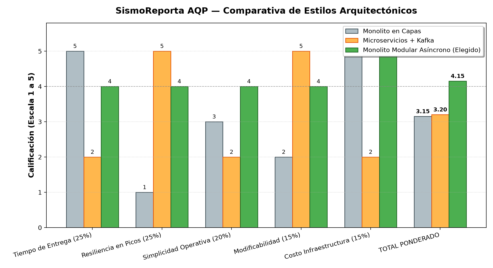

# Matriz de Decisión Arquitectónica — SismoReporta AQP
**Construcción de Software · EPIS-UNSA · 2026-B · Grupo 08**  
**Integrantes:** Santiago Palma (`santiagopalma12`), Dario Rafael Cornejo Hurtado (`darich1010`)

---

## 1. Alternativas Consideradas
* **A. Monolito en Capas Tradicional (N-Tier):**  
  Arquitectura clásica organizada en capas de presentación, lógica de negocio y acceso a datos acopladas en un único proceso de ejecución síncrono. Muy rápida de implementar inicialmente, pero sufre bloqueos en cascada ante ráfagas extremas de peticiones HTTP, no desacopla la persistencia de imágenes pesadas y la base de datos relacional se convierte en un cuello de botella fatal durante el pico del sismo.
* **B. Microservicios Distribuidos con Apache Kafka y Kubernetes:**  
  Separación en servicios autónomos e independientes (Ingesta, Triaje, Brigadas, Mapas, Notificaciones) comunicados mediante un bus de eventos Kafka y orquestados en un clúster Kubernetes. Provee máxima escalabilidad y aislamiento de fallos, pero demanda una complejidad de configuración de infraestructura, observabilidad distribuida, múltiples bases de datos y costos de mantenimiento inviables para un equipo de 2 personas en un plazo de 1 mes.
* **C. Monolito Modular Asíncrono con Colas en Memoria (Elegida):**  
  Un único artefacto desplegable en Python (FastAPI/Django) estructurado rígidamente en módulos de dominio independientes (*Bounded Contexts*) con interfaces explícitas. Incorpora **Redis** como cola de mensajería rápida en memoria y **Celery/arq workers** en segundo plano, permitiendo emitir una respuesta inmediata de recepción ($ACK$) al ciudadano y procesar el triaje geoespacial y compresión fotográfica de forma asíncrona y resiliente en un único VPS.

---

## 2. Criterios y Pesos Ponderados
Los criterios se desprenden directamente de los drivers arquitectónicos identificados y suman el 100%:

| Criterio | Peso | Justificación técnica (Driver relacionado) |
| :--- | :---: | :--- |
| **Tiempo de Entrega (Time-to-Market)** | **25%** | **R-01:** El MVP debe estar completamente desplegado y operativo en 1 mes. Penaliza arquitecturas con curva alta de setup devops. |
| **Resiliencia y Rendimiento en Picos Extremos** | **25%** | **QA-01 y QA-02:** Capacidad de tolerar 20,000 reportes en 1 hora sin pérdida de información, garantizando absorción asíncrona de ráfagas. |
| **Simplicidad Operativa y Mantenimiento** | **20%** | **R-02:** El equipo está compuesto únicamente por 2 desarrolladores. La solución debe poder administrarse, depurarse y monitorearse con mínimo esfuerzo. |
| **Modificabilidad y Desacoplamiento** | **15%** | **QA-04:** Facilidad para incorporar nuevos adaptadores externos (SINAGERD, SMS masivo, alertas zonales) sin alterar la lógica central. |
| **Costo de Infraestructura** | **15%** | **R-03:** Restricción presupuestaria estricta; debe ejecutarse en un único VPS de \$10 a \$20 USD/mes sin requerir servicios gestionados de alto costo. |
| **Total Ponderación** | **100%** | **Suma exacta de pesos ponderados.** |

---

## 3. Matriz de Decisión Ponderada
Escala de calificación: **1 (Muy Deficiente / Crítico) a 5 (Excelente / Sobresaliente)**.

| Criterio | Peso | A: Monolito en Capas | B: Microservicios + Kafka | C: Monolito Modular Asíncrono | Justificación de Puntajes |
| :--- | :---: | :---: | :---: | :---: | :--- |
| **Tiempo de Entrega** | 25% | **5** (1.25) | **2** (0.50) | **4** (1.00) | El monolito en capas es el más rápido de codificar, pero el monolito modular toma solo días extra en definir interfaces. Microservicios no llega al mes. |
| **Resiliencia en Picos** | 25% | **1** (0.25) | **5** (1.25) | **4** (1.00) | El monolito en capas síncrono colapsa bajo 20k reportes concurrentes. Microservicios y Monolito Asíncrono toleran ráfagas mediante colas. |
| **Simplicidad Operativa** | 20% | **3** (0.60) | **2** (0.40) | **4** (0.80) | Microservicios requiere service mesh, trazas distribuidas y múltiples DBs. El monolito modular unifica logs, despliegue y base de datos con PostGIS. |
| **Modificabilidad** | 15% | **2** (0.30) | **5** (0.75) | **4** (0.60) | Las capas tienden a convertirse en un "monolito de barro" con fugas de dependencias. El monolito modular aisla dominios con adaptadores limpios. |
| **Costo Infraestructura** | 15% | **5** (0.75) | **2** (0.30) | **5** (0.75) | Tanto Capas como Monolito Modular conviven perfectamente en 1 solo VPS económico. Un clúster de microservicios eleva exponencialmente el coste mensual. |
| **TOTAL PONDERADO** | **100%** | **3.15** | **3.20** | **4.15** | **Alternativa C (Monolito Modular Asíncrono) resulta ampliamente ganadora.** |

$$\text{Puntaje Total} = \sum (\text{Peso}_i \times \text{Calificación}_i)$$

* Monolito en Capas Tradicional: $0.25(5) + 0.25(1) + 0.20(3) + 0.15(2) + 0.15(5) = 1.25 + 0.25 + 0.60 + 0.30 + 0.75 = \mathbf{3.15}$
* Microservicios con Kafka: $0.25(2) + 0.25(5) + 0.20(2) + 0.15(5) + 0.15(2) = 0.50 + 1.25 + 0.40 + 0.75 + 0.30 = \mathbf{3.20}$
* Monolito Modular Asíncrono: $0.25(4) + 0.25(4) + 0.20(4) + 0.15(4) + 0.15(5) = 1.00 + 1.00 + 0.80 + 0.60 + 0.75 = \mathbf{4.15}$

---

## 4. Gráfico Comparativo Ponderado
El siguiente gráfico ilustra el balance integral entre costo, tiempo y resiliencia para el proyecto:

---

## 5. Conclusión y Decisión
Elegimos la **Alternativa C: Monolito Modular Asíncrono con Colas en Memoria (Puntaje 4.15)**.
Esta arquitectura ofrece el equilibrio perfecto entre la velocidad de desarrollo necesaria para cumplir la restricción de 1 mes (**R-01**) por un equipo de 2 ingenieros (**R-02**), junto con la resiliencia obligatoria ante picos extremos de 20,000 reportes (**QA-01, QA-02**) mediante la delegación asíncrona a workers de Redis/Celery. Además, conserva los límites de dominio desacoplados, permitiendo una eventual migración de módulos hacia servicios autónomos en el futuro si la escala interinstitucional lo requiriese.

Para el registro formal de la decisión, consúltese el documento [ADR-001: Adopción de Monolito Modular Asíncrono](adr/001-estilo-arquitectonico.md).  
La segunda mejor alternativa (**Microservicios con Kafka, 3.20**) ha sido modelada y descartada formalmente en [PlantUML Alternativa](diagramas/alternativa.puml).
